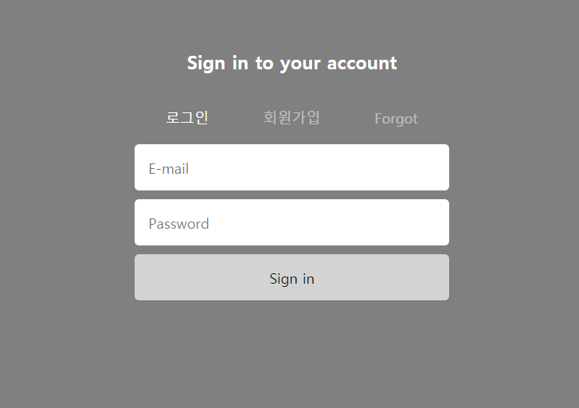
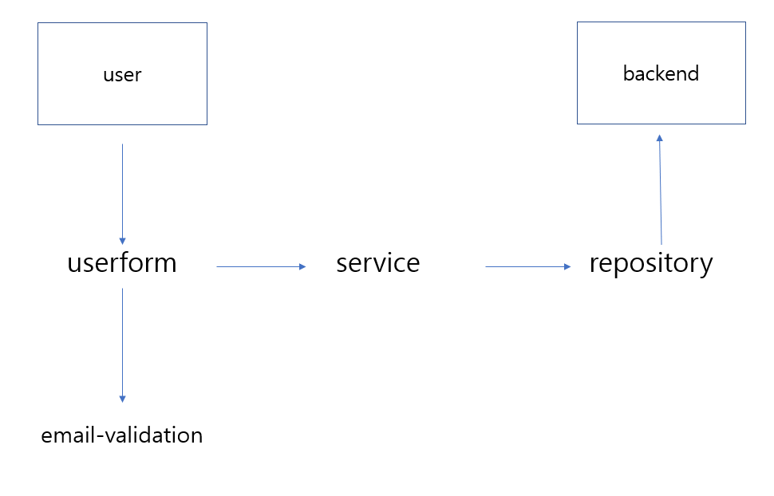

# user-form(로그인, 회원가입, 비밀번호 변경)

react를 이용한 단일페이지 로그인, 회원가입, 비밀번호 변경 컴포넌트이다.

##  Contents
- 개발 환경
- 컴포넌트 구조
- 주요 기능

## 개발 환경
- create-react-app 3.4.1
- npm 6.14.8
- libraries
> npm install @material-ui/core
> npm install axios
> npm install emailjs-com

## 컴포넌트 구조

## 주요 기능
1. 이메일 인증(회원가입, 비밀번호 변경)
사용자가 이메일을 입력하고 버튼을 누르면 해당 메일로 인증키가 전송된다.
사용자는 나머지 양식에서 인증키를 입력해야하며, 전송한 인증키와 사용자 입력키가 일치한 경우에만 backend로 데이터가 전송된다.

2. 데이터 전송
특정 URL로 양식에 맞는 데이터를 전송할 수 있다.